# Entra App Secret Monitor

## Overview

**Entra App Secret Monitor** is an Azure-native automation solution designed to proactively detect **expiring Azure Entra ID (Azure AD) App Registration secrets** and notify teams before authentication failures and production downtime occur.

Azure does not provide a built-in notification mechanism for App Registration secret expiration. This project addresses that gap using secure, scalable, and production-ready Azure services.

---

## Problem Statement

- App Registration client secrets expire silently
- Azure provides no native alerting for secret expiration
- Expired secrets cause authentication failures and service outages
- Manual tracking does not scale and is error-prone

This solution introduces **automated monitoring and alerting** using Microsoft-recommended identity and automation patterns.

---

## High-Level Architecture

The solution is built using the following Azure services:

- **Azure Logic Apps** – Workflow orchestration and decision logic
- **Azure Automation Account** – PowerShell Runbook execution
- **Microsoft Graph API** – Query App Registration secret metadata
- **Managed Identities** – Secure, secretless authentication
- **Azure Communication Services (Email)** – Notification delivery

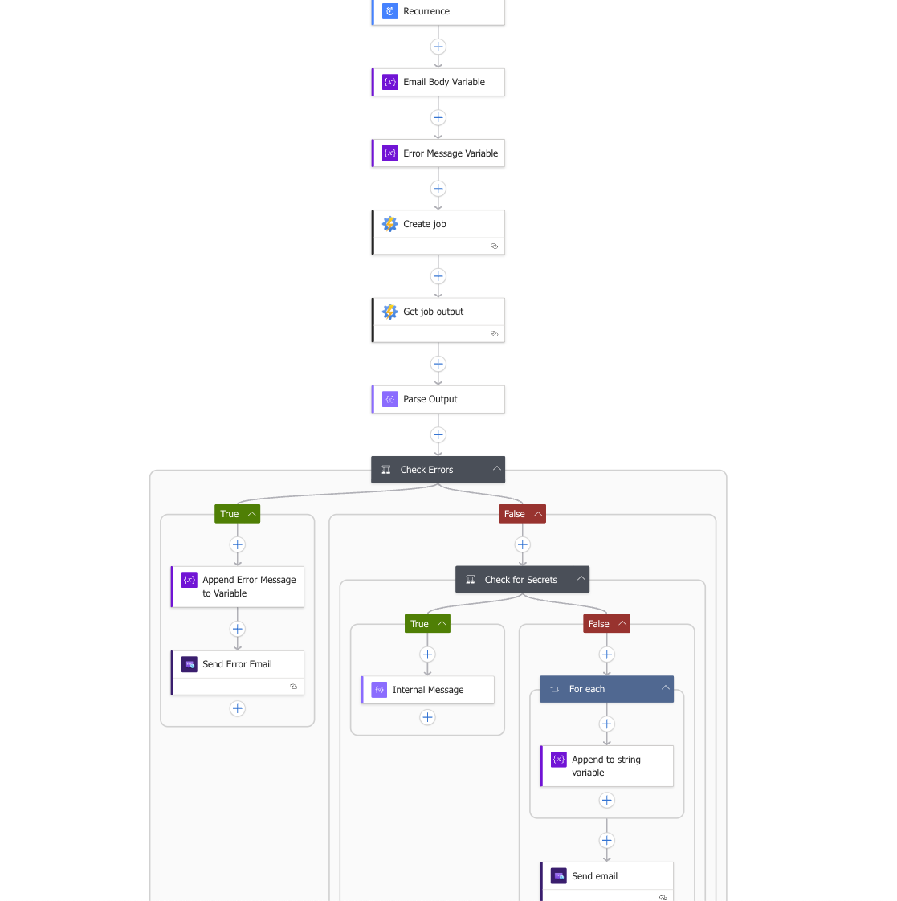

---

## Identity & Security Design

This solution is fully **secretless**.

Two Managed Identities are used:

- **Automation Account Managed Identity**
  - Queries Microsoft Graph for App Registration secret information
- **Logic App Managed Identity**
  - Triggers the Automation Runbook securely

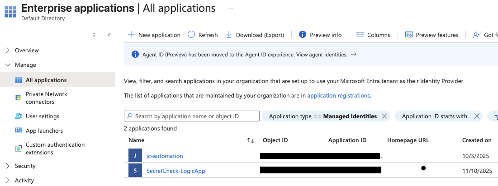

### Microsoft Graph API Permissions

The Automation Account Managed Identity is granted **least-privilege** Microsoft Graph permissions required to read application credentials.

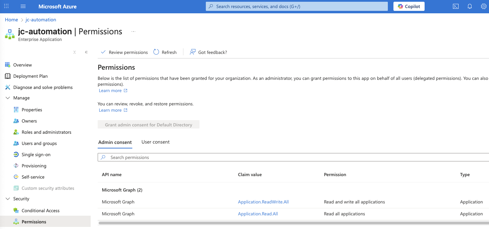

---

## App Registrations Under Monitoring

The Automation Runbook queries Azure Entra ID App Registrations and evaluates their client secrets against an expiration threshold.

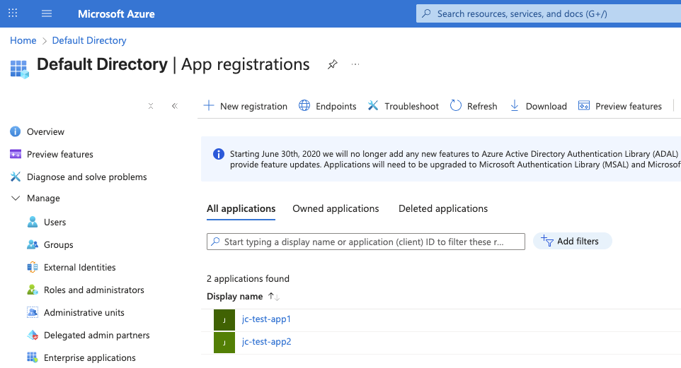

---

## PowerShell Runbook

The PowerShell Runbook performs the following operations:

1. Authenticates to Microsoft Graph using Managed Identity
2. Retrieves App Registration objects
3. Enumerates client secrets
4. Evaluates expiration dates
5. Classifies secrets as:
   - `Expired`
   - `ExpiringSoon`
6. Outputs structured JSON
7. Handles errors using `try/catch`

The Runbook can be executed independently using the **Azure Automation Test Pane**.

### Successful Test Pane Output

The Runbook returns structured JSON that is later consumed by the Logic App.

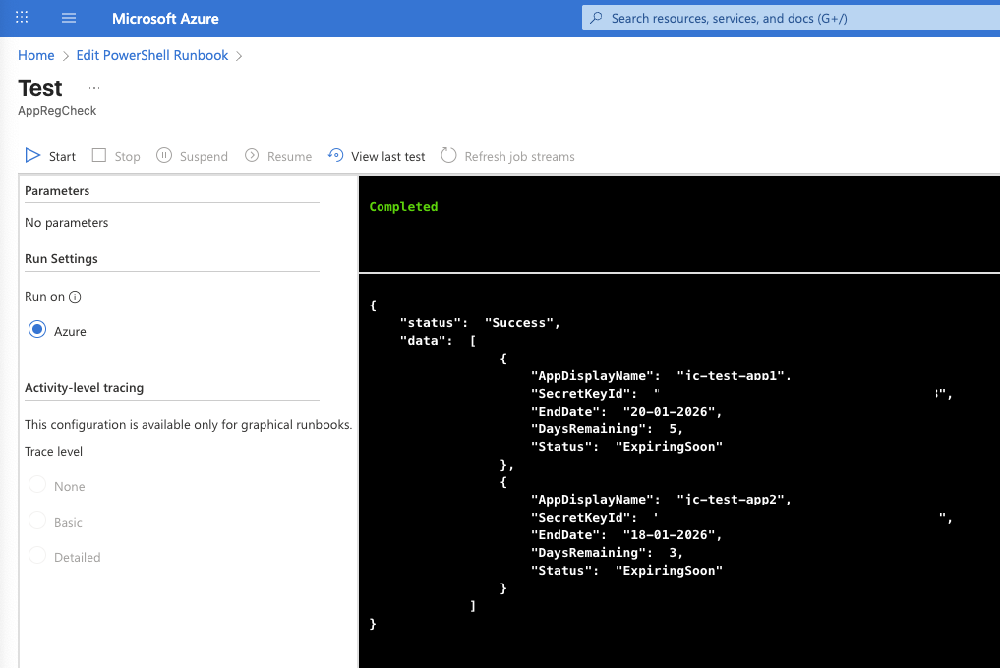

### Error Handling Example

Errors are returned as structured JSON to allow the Logic App to react accordingly.

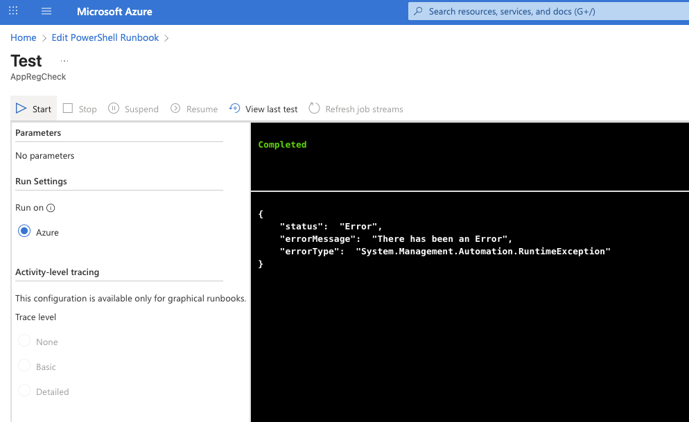

---

## Logic App Workflow Details

### Runbook Execution & Output Retrieval

The Logic App:
- Creates an Automation Runbook job
- Waits for completion
- Retrieves the job output for evaluation

---

### JSON Parsing

The Runbook output is parsed using a defined JSON schema to enable structured conditions and branching logic.

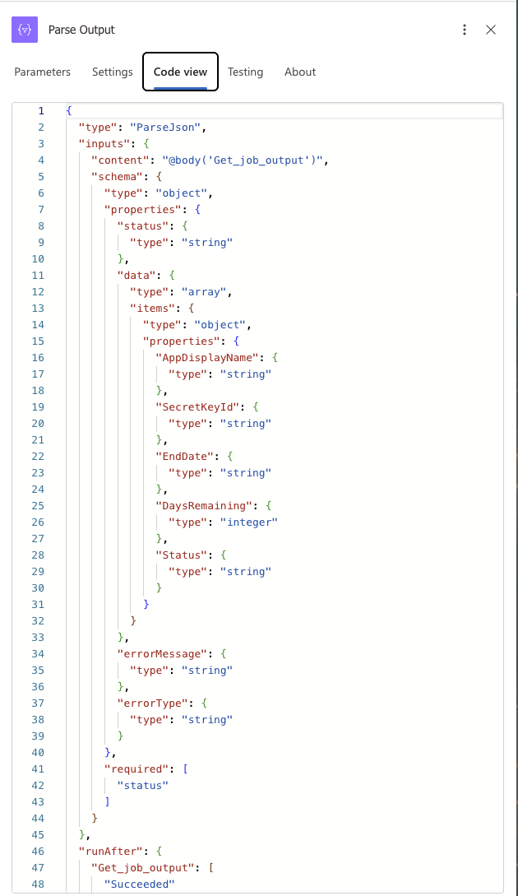

---

### Conditional Logic

The Logic App evaluates the Runbook output in multiple stages:

1. **Status == Error**
   - Routes to an error-notification flow
2. **Empty Data Array**
   - Ends execution silently (no expiring secrets)
3. **Secrets Found**
   - Formats data and sends a notification email

### Formatting Secret Data

A `For each` loop is used to format secret information into a human-readable email body.

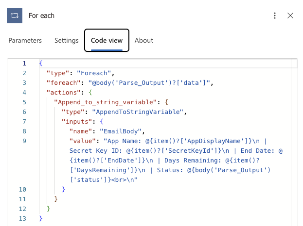

---

## Email Notification System

### Azure Communication Services (Email)

Azure Communication Services is used to send notification emails using a verified Azure domain.

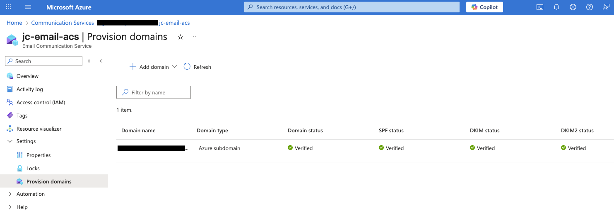

### Sample Notification Email

When expiring or expired secrets are detected, a notification email is sent containing formatted secret details.

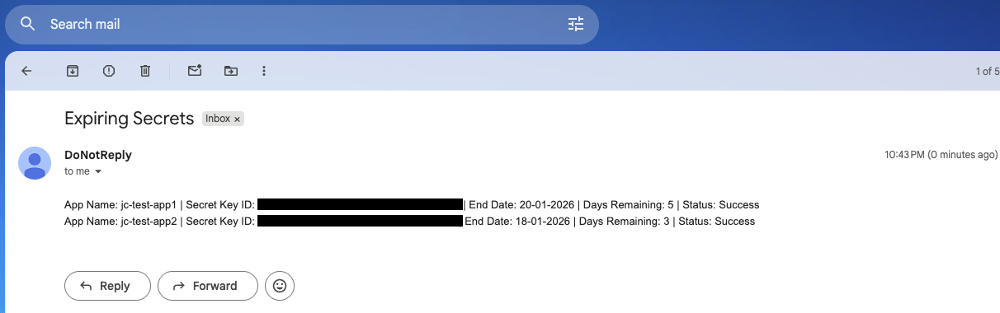

---

## Execution & Monitoring

Each Logic App execution is logged and visible via run history, providing operational visibility and traceability.

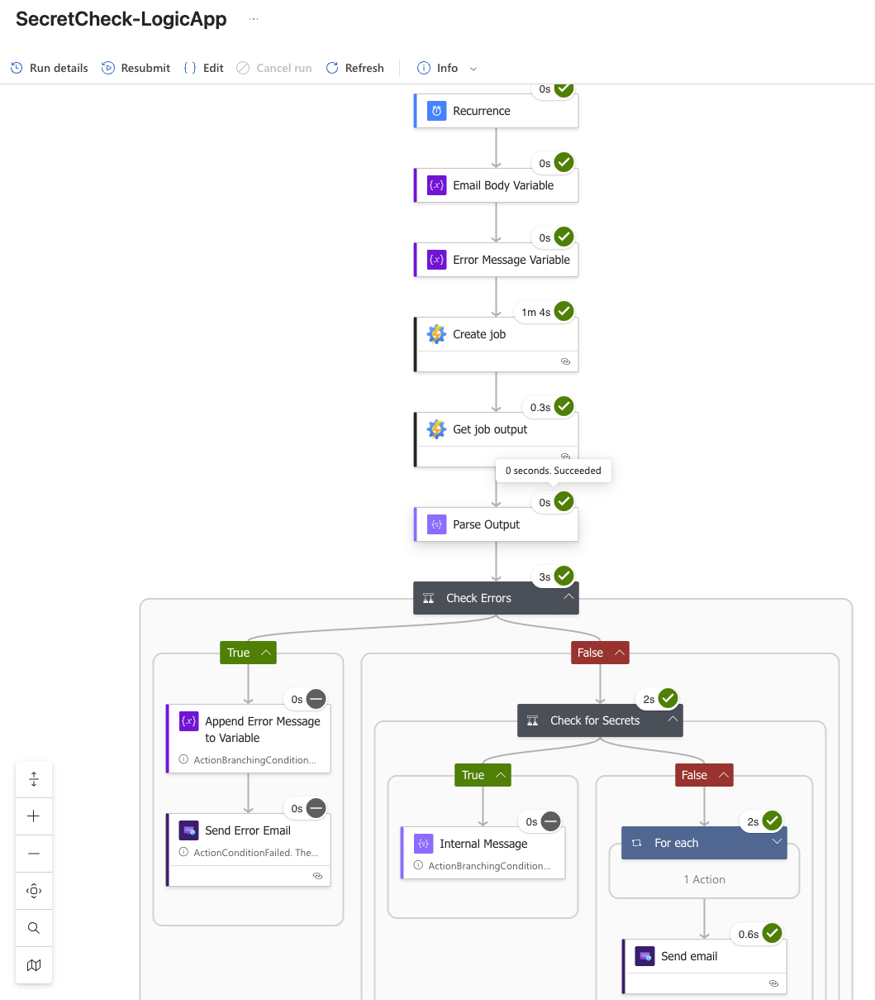

---

## Security Considerations

- Managed Identity authentication only
- No secrets or credentials stored in code
- Tenant-specific identifiers redacted
- Least-privilege Microsoft Graph permissions
- Public-repo safe design

---

## Skills Demonstrated

- Azure Logic Apps (advanced workflow orchestration)
- Azure Automation & Runbooks
- PowerShell scripting
- Microsoft Graph API integration
- Managed Identity authentication
- Secure cloud automation design
- JSON parsing and conditional workflows
- Identity-focused operational monitoring

---

## Use Cases

- Preventing authentication-related outages
- App Registration lifecycle management
- Enterprise identity governance
- Integration with ticketing systems

---

## Future Enhancements

- Certificate expiration monitoring
- Configurable expiration thresholds
- Azure Monitor / Alert integration
- Microsoft Teams or webhook notifications

---

## Author

**JcPrince**  
Cloud / DevOps Engineer

> All identifiers and tenant-specific values have been redacted for security purposes.
